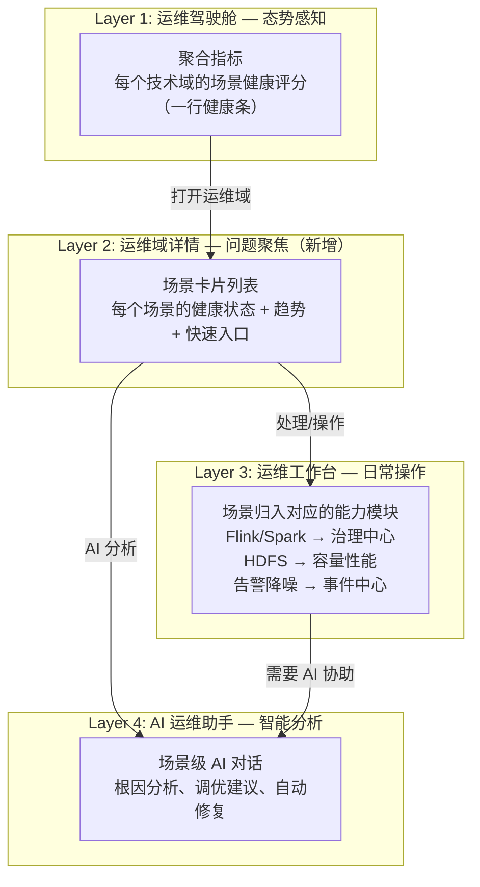
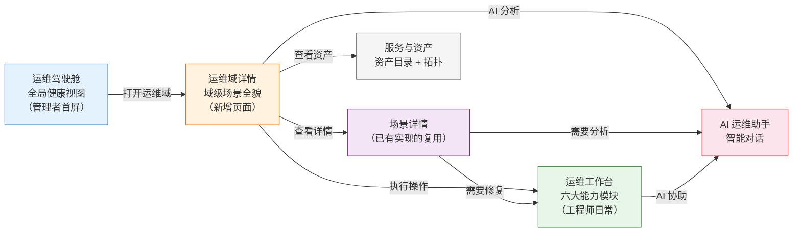

# 运维驾驶舱导航 & 业务场景放置分析

> [!NOTE]
> 本分析基于以下输入：
> - 当前截图中的页面表现
> - 项目代码 (`overview.ts`, `assets-view.ts`, `workbench.ts`, `tech-ops-domain.ts` 等)
> - 之前多轮专家评审形成的 **9 条核心共识**（见 `implementation-plan-v2-final.md`）
> - 已实现的 BCH 业务场景（Flink 作业健康度、Spark 调优、HDFS FSImage 等）

---

## 问题一："打开运维域" → 服务与资产，合理吗？

### 结论：**不合理**，与已有架构共识存在冲突

### 现状分析

从截图和代码可以看到当前行为：

```
运维驾驶舱 → BCH生态卡片 → "打开运维域" → 服务与资产 > 资产目录（BCH生态 Tab 选中）
```

### 为什么不合理？

> [!IMPORTANT]
> **与核心共识冲突**：之前的专家评审已达成共识——运维驾驶舱的定位是"**看**"（态势感知），服务与资产的定位是"**管的对象**"（资产管理）。从"看全局"直接跳到"管资产"，跳过了"**分析问题**"和"**处理问题**"的环节。

| 维度 | 用户期望 | 实际跳转 |
|------|---------|---------|
| **语义** | "打开运维域"→ 进入该业务域的**运维上下文** | 进入该业务域的**资产清单** |
| **工作流** | 看到异常 → 下钻分析 → 决定行动 | 看到异常 → 看资产列表（然后呢？） |
| **角色匹配** | 管理者在驾驶舱发现问题，想深入了解 | 跳到了资产管理页，偏运维工程师的管理视角 |

### 与四大模块定位的对照

根据之前专家评审形成的共识，四大模块的定位如下：

| 模块 | 定位 | 核心动词 |
|------|------|---------|
| **运维驾驶舱** | 管理者看全局状态 | **看** |
| **运维工作台** | 工程师日常运维工作 | **做** |
| **服务与资产** | 承载技术域资产和上下文过滤 | **管** |
| AI 运维助手 | 智能分析和推荐 | **问** |

"打开运维域"这个动作的语义是从"**看**"进入一个域的详细运维视角，但当前却跳到了"**管**"。

### 建议方案

#### 方案 A（推荐）：引入"运维域详情页"作为驾驶舱的下钻页

新增 `/overview/domain/:domainId` 路由，作为驾驶舱的下钻页面：

```
运维驾驶舱 (/overview)
  └── 业务域卡片 → "打开运维域"
        └── /overview/domain/hadoop  ← 新页面：运维域详情
              ├── 📊 域健康概览（健康评分趋势、关键指标汇总）
              ├── 🔔 该域待处理告警（Top 告警、趋势图）
              ├── ⚙️ 业务场景状态（Flink/Spark/HDFS 等场景健康卡片）
              ├── 📋 最近巡检结果
              └── 🔗 快速跳转
                    ├── → 运维工作台（处理告警、执行巡检）
                    ├── → 服务与资产（查看该域资产详情）
                    └── → AI 运维助手（智能分析）
```

> [!TIP]
> **核心价值**：运维域详情页是**驾驶舱的自然下钻**，定位仍然是"看"，但看的是更细粒度的信息。它是连接"看"（驾驶舱）和"做"（工作台）的桥梁。

**这个方案的关键点**：
- 路由放在 `/overview/domain/` 下，归属于驾驶舱，不是服务与资产
- 不重复实现工作台的操作能力，只提供"状态展示 + 跳转入口"
- 与已有的技术域全局过滤器不冲突——那个是切换全局上下文，这个是驾驶舱的下钻

#### 方案 B：直接跳转到运维工作台（带域过滤）

```
"打开运维域" → /workbench?domain=hadoop
```

- 优点：复用现有页面，零开发成本
- 缺点：从"管理者视角的驾驶舱"直接跳到"工程师视角的工作台"，角色跳跃

#### 方案 C：修改按钮文案

如果暂时不新增页面，至少改按钮文案：
- "打开运维域" → "**查看域资产**" 或 "**资产管理**"

> [!WARNING]
> 方案 C 成本最低但体验最差——弱化了驾驶舱的"运维导航"能力，不推荐作为最终方案。

### 方案对比

| 维度 | 方案 A: 新增域详情页 | 方案 B: 跳工作台 | 方案 C: 改文案 |
|------|:---:|:---:|:---:|
| 语义一致性 | ✅ 高 | ⚠️ 中 | ✅ 高 |
| 用户体验 | ✅ 最佳 | ⚠️ 角色跳跃 | ❌ 弱化导航 |
| 开发成本 | ⚠️ 需新增页面 | ✅ 零成本 | ✅ 零成本 |
| 架构一致性 | ✅ 符合"看→做→管"分层 | ⚠️ 跳过分析层 | ❌ 无改进 |
| **推荐度** | ⭐⭐⭐ | ⭐⭐ | ⭐ |

---

## 问题二：业务场景应该放在哪里？

### 现状盘点

根据代码研究，以下业务场景**已经实现**了 UI 和 Mock 数据：

| 场景 | 实现文件 | 当前位置 |
|------|---------|---------|
| Flink 作业健康度 | [bch-job-governance.ts](file:///Users/isadmin/MagicSpace/openocta/ui/src/ui/views/ops/bch-job-governance.ts) | 技术域运维 → BCH → 作业治理 Tab |
| Spark 作业调优 | [bch-job-governance.ts](file:///Users/isadmin/MagicSpace/openocta/ui/src/ui/views/ops/bch-job-governance.ts) | 技术域运维 → BCH → 作业治理 Tab |
| HDFS FSImage 分析 | [bch-fsimage-dashboard.ts](file:///Users/isadmin/MagicSpace/openocta/ui/src/ui/views/ops/bch-fsimage-dashboard.ts) | 技术域运维 → BCH → 容量性能 Tab |
| BCH 集群健康度 | [bch-cluster-overview.ts](file:///Users/isadmin/MagicSpace/openocta/ui/src/ui/views/ops/bch-cluster-overview.ts) | 技术域运维 → BCH → 概览 Tab |
| BCH 数字员工工作站 | [bch-employee-workstation.ts](file:///Users/isadmin/MagicSpace/openocta/ui/src/ui/views/ops/bch-employee-workstation.ts) | 技术域运维 → BCH → 数字员工 Tab |

> [!IMPORTANT]
> **问题**：这些场景目前都在旧的"技术域运维"视图下（`tech-ops-domain.ts`），通过每个技术域的10个能力子 Tab 来组织。但根据之前的架构共识，**技术域应该作为全局上下文过滤器，而不是每个域复制一套完整的能力菜单**。

### 设计原则

根据之前达成的核心共识：

1. **技术域 = 全局上下文过滤器**，不是独立的菜单树
2. **能力（告警、巡检、诊断、治理、容量、变更）住在工作台**
3. **AI 嵌入工作流**，不独立成中心
4. **业务场景 = 能力域 × 技术域的交集**

### 推荐的四层放置策略



### 各层具体设计

---

### Layer 1: 运维驾驶舱（一眼看全局）

**展示形式**：聚合指标，不展示单个场景细节

```
┌─ BCH 生态 ──────────────────────────┐
│  2 个集群  │  运行正常               │
│                                      │
│  作业健康: ██████████ 92%           │  ← Flink + Spark 聚合
│  存储健康: ████████░░ 78%           │  ← HDFS 聚合
│  服务健康: █████████░ 88%           │  ← Kafka + HBase 聚合
│                                      │
│  [打开运维域]                        │
└──────────────────────────────────────┘
```

**改进点**：现有的域卡片只有"集群数 + 运行平稳"，信息密度太低。增加场景维度的健康条，让管理者一眼判断哪个维度有问题。

---

### Layer 2: 运维域详情页（看清问题 — 新增）

**展示形式**：场景卡片 + 关键指标

```
┌─ BCH 生态 运维域详情 ────────────────────────────────────────────┐
│  面包屑: 运维驾驶舱 > BCH 生态                                    │
│                                                                    │
│  📊 域健康概览                                                     │
│  ┌──────────┬──────────┬──────────┬──────────┐                    │
│  │ 综合评分  │  告警     │ 运行作业 │  集群    │                    │
│  │  85/100  │  3 待处理 │ 12 运行  │  2 正常  │                    │
│  └──────────┴──────────┴──────────┴──────────┘                    │
│                                                                    │
│  ⚙️ 业务场景                                                       │
│  ┌─ Flink 作业健康度 ──────┐  ┌─ Spark 作业调优 ──────────┐       │
│  │ 健康评分: 92%           │  │ 待调优作业: 2              │       │
│  │ 运行作业: 8 / 异常: 1 ⚠│  │ 潜在优化收益: 30% 资源     │       │
│  │ [查看详情] [AI 分析]    │  │ [查看详情] [AI 调优]       │       │
│  └─────────────────────────┘  └────────────────────────────┘       │
│                                                                    │
│  ┌─ HDFS 健康度 ───────────┐  ┌─ 集群巡检 ────────────────┐       │
│  │ 存储利用率: 78%         │  │ 最近巡检: 2小时前          │       │
│  │ DataNode: 12/12 ✅      │  │ 风险项: 2 条               │       │
│  │ [查看详情] [AI 分析]    │  │ [查看报告] [启动巡检]      │       │
│  └─────────────────────────┘  └────────────────────────────┘       │
│                                                                    │
│  🔔 该域最新告警                                                   │
│  • [Critical] Flink etl_order 延迟超阈值              2 分钟前    │
│  • [Warning]  HDFS DataNode-03 磁盘 > 85%            15 分钟前    │
│                                                                    │
│  📋 快速跳转                                                       │
│  [→ 事件中心] [→ 巡检中心] [→ 域资产管理] [→ AI 助手分析]         │
└────────────────────────────────────────────────────────────────────┘
```

> [!IMPORTANT]
> **这是业务场景的"主展示阵地"**。从这里，用户能看到所有场景的健康状态全貌，并决定下一步：是去工作台处理，还是找 AI 分析。

---

### Layer 3: 运维工作台（执行操作）

根据已有的工作台 6 大模块，业务场景的**操作能力**归入对应模块：

| 工作台模块 | 承载的业务场景操作 |
|-----------|------------------|
| **事件中心** | 告警降噪、Flink/Spark 作业异常告警处理 |
| **巡检中心** | 集群深度巡检（已有）、场景级巡检 |
| **诊断中心** | Flink 作业根因分析、Spark 性能诊断 |
| **治理中心** | Flink 作业治理、Spark 作业调优（应用参数变更） |
| **容量性能** | HDFS 健康度/FSImage 分析、Yarn 资源调度、容量规划 |
| **变更护航** | 参数变更风险评估、版本升级评估 |

> [!TIP]
> 工作台内使用**技术域全局过滤器**来切换上下文。例如选择"BCH 生态"后，治理中心只展示 Flink/Spark 相关的治理任务。这正是之前共识中"**技术域作为全局上下文过滤器**"的落地。

**关键改造**：现有的 `bch-job-governance.ts` 和 `bch-fsimage-dashboard.ts` 中的**操作能力**（如调优参数应用、作业重启等），应从旧的技术域 Tab 视图迁移到工作台的对应模块中。

---

### Layer 4: AI 运维助手（智能分析）

AI 助手在业务场景中的触达方式：

| 触达方式 | 说明 |
|---------|------|
| **顶栏常驻按钮** | 类似 GitHub Copilot 图标，随时开启侧边对话 |
| **场景内嵌 AI 按钮** | 域详情页每个场景卡片的"AI 分析"按钮 |
| **工作台上下文 AI** | 告警详情页的"分析根因"、巡检报告的"解释风险" |
| **快捷键** | `Cmd+K` 或 `/` 唤出 AI 对话框 |

---

### 服务与资产（资产视角补充）

服务与资产不是业务场景的主入口，但可以作为**上下文增强**：
- 查看某个 Flink 集群的资产详情时，侧边展示"作业健康度"摘要
- 查看 HDFS 集群资产时，附带"存储健康度"快速指标
- 点击可跳转到对应场景详情

---

## 具体落地建议

### 需要新增的内容

| 项目 | 路由 | 说明 |
|------|------|------|
| 运维域详情页 | `/overview/domain/:domainId` | 驾驶舱下钻页面，业务场景的主展示位 |
| 驾驶舱域卡片增强 | - | 增加场景维度的聚合健康条 |

### 需要迁移的内容

| 现有实现 | 从 | 到 |
|---------|----|----|
| Flink 作业健康度 (展示) | 技术域 → BCH → 作业治理 | 运维域详情页 → 场景卡片 |
| Flink 作业健康度 (操作) | 技术域 → BCH → 作业治理 | 工作台 → 治理中心/诊断中心 |
| Spark 作业调优 (展示) | 技术域 → BCH → 作业治理 | 运维域详情页 → 场景卡片 |
| Spark 作业调优 (操作) | 技术域 → BCH → 作业治理 | 工作台 → 治理中心 |
| HDFS FSImage (展示) | 技术域 → BCH → 容量性能 | 运维域详情页 → 场景卡片 |
| HDFS FSImage (操作) | 技术域 → BCH → 容量性能 | 工作台 → 容量性能 |

### 旧页面的处理

> [!WARNING]
> 旧的 `tech-ops-domain.ts`（技术域运维视图，包含10个能力子 Tab）需要评估是否保留。根据之前的架构共识，技术域已经从独立菜单树转变为全局上下文过滤器。
> 
> **建议**：
> - 短期：保留旧页面，新旧并存
> - 中期：将旧页面中的展示能力迁移到"运维域详情页"，操作能力迁移到"工作台"
> - 长期：下线旧的技术域视图

---

## 整体导航流（完整）



---

## 总结

| 决策点 | 建议 |
|-------|------|
| **"打开运维域"跳转目标** | ❌ 不应跳到服务与资产 → ✅ 新增"运维域详情页"（`/overview/domain/:id`）|
| **业务场景主展示位** | 运维域详情页 → 场景卡片（看全貌、选方向） |
| **业务场景操作位** | 运维工作台 → 六大能力模块（做操作、解决问题） |
| **业务场景感知位** | 运维驾驶舱 → 聚合健康条（一眼发现异常） |
| **业务场景分析位** | AI 运维助手 → 嵌入各场景的 AI 按钮 |
| **服务与资产的角色** | 资产管理 + 场景健康的上下文补充，不是场景主入口 |
