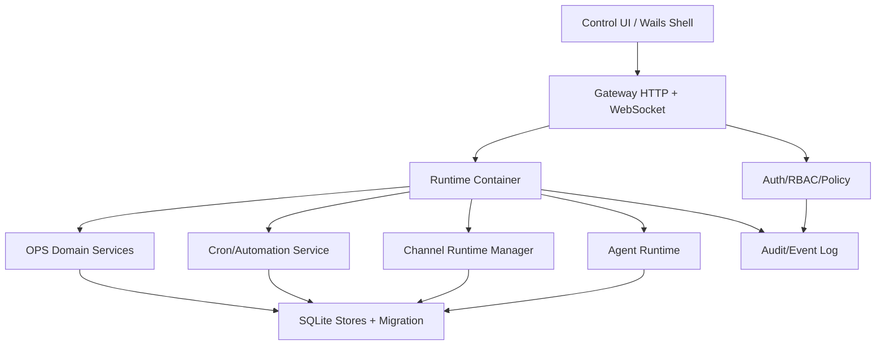

# OpenOcta 项目整体评审报告

评审日期：2026-06-07  
评审范围：仓库结构、Go/Wails 后端、Vite/Lit 前端、Gateway 协议、配置与运行时、运维场景、测试与交互体验。

## 1. 总体结论

OpenOcta 当前已经具备较完整的企业级 AI Agent 控制面雏形：单一 Go 二进制交付、内嵌前端、WebSocket Gateway、Agent/Channel/Cron/Session/OPS 等能力域拆分较明确，前端也已围绕聊天、数字员工、技能市场、运维工作台、配置中心等场景形成可用闭环。

但从工程成熟度看，项目正处在“功能快速叠加后需要系统性收敛”的阶段。主要风险不是缺少功能，而是控制面安全默认值偏弱、前后端核心编排层过重、权限模型在 HTTP 与 WebSocket 两套通道中不一致、运行时错误被吞掉、JSON 文件型状态存储会限制并发与可观测性。这些问题如果不优先治理，会影响后续扩展到多用户、多通道、多租户或生产运维场景。

建议优先级：

1. P0：恢复 HTTP Gateway 鉴权、限制 CORS/Origin、关闭或保护 pprof、避免桌面模式固定共享 token。
2. P1：拆分 Gateway 装配层与前端巨型 App 状态，将权限、协议方法、路由注册、运行时生命周期显式建模。
3. P2：把 OPS、Cron、Session 等核心状态逐步从 JSON 文件迁移到 SQLite/事务存储，增加迁移与并发测试。
4. P3：统一交互信息架构，压缩导航层级，建立高风险操作确认、异步任务状态与错误恢复规范。

## 2. 项目现状画像

### 2.1 技术栈

- 后端：Go 1.25，Wails v2，net/http + gorilla/websocket，sqlite、robfig/cron、agentsdk-go、MCP SDK、多个 IM/企业通道 SDK。
- 前端：Vite 7、TypeScript 5、Lit 3、Vitest、Playwright browser tests。
- 交付：Go 后端 + 内嵌前端，桌面端通过 Wails 启动本地 Gateway。
- 状态：配置、会话、Cron、部分 OPS 数据仍以 JSON/JSONL 文件为主；RBAC 已有 SQLite 初始化。

### 2.2 主要能力域

- Gateway：HTTP API、WebSocket req/res/event 协议、静态前端服务、Webhook、站点代理、RBAC 中间件。
- Agent：模型工厂、技能加载、工具桥、聊天与会话历史。
- Channels：DingTalk、Feishu、WeWork、Weixin、QQ、Telegram、Slack、Discord、WhatsApp 等插件化通道。
- Cron/Automation：定时任务、巡检任务、运行日志、通道投递。
- OPS：集群资产、健康信号、告警聚合、BCH 场景、巡检报告。
- UI：聊天主界面、数字员工、技能/工具/模型库、运维工作台、配置中心、日志、用量、RBAC 登录。

### 2.3 已有优点

- 能力域目录拆分清楚，`src/pkg/*` 已按业务边界划分，后续模块化有基础。
- Gateway 协议有 `PROTOCOL_VERSION` 与统一 frame 类型，具备演进空间。
- 前端已有较多纯函数和浏览器测试，导航、配置、Markdown、OPS 组件等已有回归基础。
- 配置保存使用 `baseHash` 乐观并发控制，说明已意识到配置覆盖问题。
- Channel Runtime 与 Channel Plugin 有抽象层，适合继续向多账号、多通道扩展。
- 文档数量较丰富，包含架构、部署、OPS、UI 风格、通道配置等沉淀。

## 3. 分维度评估

### 3.1 架构设计

当前架构可以概括为“单进程控制面 + 本地 Gateway + 插件式运行时 + 文件状态存储”。这个形态适合桌面、本地部署、PoC 和中小规模单节点场景。

优势：

- 单二进制降低部署复杂度。
- Gateway 作为统一控制面，前端和外部 hooks 都能通过同一进程接入。
- `pkg/channels`、`pkg/cron`、`pkg/ops`、`pkg/session`、`pkg/swarm` 等能力域已有独立包。

主要问题：

- `src/pkg/gateway/http/server.go` 的 `NewServer` 同时承担状态目录解析、RBAC/OPS 初始化、工具 hook 注入、配置加载、环境变量写入、Cron、Channel、Swarm、HTTP 路由、WebSocket Hub 装配等职责。文件中 101 行开始的 `NewServer` 已成为系统级“总装函数”，后续新增能力会继续放大耦合。
- Gateway Context 通过大量函数指针和闭包连接模块，短期灵活，长期会让依赖关系隐式化，测试也更难构造。
- 工具到 OPS 的连接通过全局函数赋值实现，例如 `tools.GetClusterConfig`，这类隐式全局依赖不利于并发测试和多实例。
- MCP Manager 初始化代码处于注释状态，但相关字段仍保留，说明架构演进中存在未闭环能力。

建议：

- 引入 `AppContainer` 或 `RuntimeContainer`，把 Config、Stores、RBAC、OPS、Cron、Channels、Swarm、GatewayHandlers 明确作为依赖注入。
- 将 `registerRoutes` 按域拆为 `RegisterAuthRoutes`、`RegisterOpsRoutes`、`RegisterConfigRoutes`、`RegisterSiteProxyRoutes`、`RegisterDebugRoutes`。
- 将工具依赖从全局函数改为接口，例如 `ClusterRepository` 注入到 tools registry。
- 对 `handlers.Context` 做分层：只保留请求期上下文，运行时服务放入专门 `Services` 结构。

### 3.2 框架与工程组织

后端 Go 包结构总体合理，但 Gateway handlers 中仍有多个超大文件：`chat.go` 约 2709 行，`sessions.go` 约 2478 行，`skills.go` 约 1899 行。这些文件已经超过单一职责边界。

前端 Lit 方案轻量，但当前 `ui/src/ui/app.ts` 持有大量 `@state` 字段，单文件约 1756 行。`app.ts` 144 行后的 `OpenClawApp` 同时承载连接、聊天、配置、通道、审批、运维工作台、数字员工、导航、弹窗等状态，任何新功能都容易把状态挂到根组件。

建议：

- 后端按 use case 拆 handler：例如 chat 拆成 `history`、`send`、`stream`、`attachments`、`abort`、`session_binding`。
- 前端将根组件降级为 shell，只持有布局级状态；业务状态迁移到 domain stores/controllers，例如 `chatStore`、`configStore`、`opsWorkbenchStore`。
- 建立模块边界规则：view 不直接拼复杂业务对象，controller 不直接依赖根组件全部字段。
- 增加轻量 ADR，记录为什么选 Lit/Wails/文件存储/SQLite，避免演进依据散落在代码注释中。

### 3.3 可扩展性

可扩展性基础较好，尤其是 Channels、Skills、MCP、Cron、OPS 场景都有扩展点。但当前扩展成本会被以下因素拉高：

- WebSocket 方法列表在 `src/pkg/gateway/ws/hub.go` 75-106 行硬编码，权限、handler 注册、前端能力发现分散在不同位置。
- HTTP RBAC 有 `requirePermission` 与 `requireRbacOrGatewayToken`，WebSocket 连接只校验 token/RBAC token 是否有效，后续方法调用没有看到按 method 的权限检查。连接成功后能调用 `config.set`、`skills.install`、`cron.run` 等高风险方法，权限模型不够细。
- Channel Manager 的 `Start` 和 `Stop` 在 71-82 行、85 行后对错误仅构造 `fmt.Errorf` 后丢弃，调用者无法知道哪些通道失败。
- OPS 健康数据已经抽象了 Store 接口，但实现仍是全局变量 + JSON 文件，扩展到多数据源、多租户或高频采集时会受限。

建议：

- 定义 `MethodDescriptor`：包含 method、handler、requiredPermission、auditLevel、maxPayload、rateLimit、featureFlag。
- WebSocket Dispatch 前统一执行权限检查和审计记录。
- Channel Manager 返回结构化启动结果：成功、失败、账号、错误类型、是否可重试。
- 对 JSON Store 抽象保留接口，但新增 SQLite 实现和迁移工具；先迁 OPS，再迁 Cron/Sessions。

### 3.4 安全与权限

这是当前最需要优先处理的维度。

#### P0-1：HTTP Gateway Token 被硬编码关闭

`src/pkg/gateway/http/auth.go` 16-17 行定义 `gatewayHTTPAuthDisabled = true`，`validateGatewayToken` 在 47-50 行直接放行。由于大量 API 使用 `requireRbacOrGatewayToken`，这会导致 fallback gateway token 永远通过，实际绕过了 RBAC 权限。

影响：

- `/api/ops/*`、`/api/config`、`/api/skills/upload`、`/api/desktop/*` 等接口可能无需有效 token 即可访问。
- 如果 Gateway 绑定非 loopback 或被本机其他进程访问，风险很高。

建议：

- 立即移除该常量或改为只在测试构建标签下启用。
- 默认要求 RBAC session 或有效 Gateway Token。
- 给相关 HTTP handler 增加未授权测试。

#### P0-2：WebSocket Origin 放行所有来源

`src/pkg/gateway/ws/hub.go` 28-34 行 `CheckOrigin` 返回 true。虽然握手阶段会校验 token，但结合固定默认 token、HTTP 鉴权关闭、CORS 放开，会放大跨站或本机恶意页面调用 Gateway 的风险。

建议：

- 桌面模式只允许 `http://127.0.0.1:*`、`http://localhost:*`、Wails 内置 origin。
- 服务端模式从配置读取 `gateway.allowedOrigins`。
- Origin 不匹配时记录审计日志。

#### P0-3：pprof 无认证暴露

`src/pkg/gateway/http/server.go` 587-593 行直接注册 `/debug/pprof/*`。如果生产或局域网可访问，可能泄露 goroutine、heap、cmdline、trace 等敏感信息。

建议：

- 默认关闭 pprof。
- 仅在 `OPENOCTA_ENABLE_PPROF=1` 时注册。
- 仍需加 RBAC 管理员权限或只绑定 loopback。

#### P0-4：桌面模式固定默认 Gateway Token

`src/pkg/config/config.go` 74-79 行定义固定 token，并在桌面模式下把非默认 token 覆盖为默认值。固定共享密钥降低了本机攻击门槛，也不利于多实例隔离。

建议：

- 首次启动生成随机 token，写入 state dir，前端通过 Wails 安全桥或本地 bootstrap 获取。
- 不覆盖用户已设置的随机 token。
- 对旧版本固定 token 做一次迁移。

### 3.5 数据与状态管理

当前状态存储采用混合模式：RBAC 使用 SQLite，Session/Cron/OPS 多数仍使用 JSON/JSONL。这个选择适合早期快速迭代，但需要明确迁移路径。

风险：

- JSON 文件写入缺少原子写策略时可能出现进程退出导致文件半写。
- 多 goroutine 或多实例并发写入时，容易最后写覆盖。
- JSONL 运行日志增长后查询成本上升。
- 全局 store 变量让测试间隔离和未来多租户困难。

建议：

- 所有文件写入统一走 `atomicWriteFile`：写临时文件、fsync、rename。
- 引入 Store 接口和事务边界，先实现 SQLite 后端。
- 为 Session/Cron/OPS 增加 schema version 和迁移。
- 对运行日志建立索引字段：jobId、sessionKey、domain、startedAt、status。

### 3.6 交互体验

当前 UI 覆盖面很广，说明产品目标明确：聊天、数字员工、市场、运维工作台、配置中心都在同一个控制面内。但导航和信息架构已经出现复杂化趋势。

观察：

- `ui/src/ui/navigation.ts` 14-62 行定义了 40+ 个 Tab，且包含新旧入口、运维域、资产、市场、配置、调试等混合概念。
- `LEGACY_PATH_TO_TAB` 表示导航曾发生迁移，旧路径兼容存在，但用户心智可能不稳定。
- 根组件状态过多导致不同场景的加载、错误、忙碌态容易互相污染。
- 运维场景已有地图、健康、巡检、AI 分析等模块，但需要更统一的任务状态与结果解释。

建议：

- 将一级导航压缩为 5 类：消息、员工、能力市场、运维、设置。
- 运维域用二级域过滤器，不作为全局 Tab 平铺。
- 高风险操作统一确认：配置应用、清空工作区、卸载、技能安装、通道注销。
- 所有异步任务统一呈现状态：排队中、运行中、成功、失败、可重试、最近一次运行。
- 错误信息分层：用户可理解摘要 + 可展开技术细节 + 复制诊断按钮。
- 对新用户提供“最小成功路径”：配置模型、创建员工、发起对话、连接一个通道。

### 3.7 测试与质量

项目已有约 95 个测试文件，前端 Vitest/browser test 较多，后端 OPS、Agent、Session、Gateway 协议也有测试。这是好基础。

缺口：

- HTTP 鉴权关闭这种风险应被测试捕获，目前没有看到对应红线测试。
- WebSocket method 级权限、跨 Origin、pprof 注册条件缺少测试。
- Channel Runtime 启停错误被吞掉，缺少失败可观测测试。
- 文件存储并发写、半写恢复、迁移兼容缺少压力或故障注入测试。
- 前端端到端测试更多覆盖页面渲染与局部交互，关键业务流需要补齐。

建议新增测试：

- `TestRequireRbacOrGatewayTokenRejectsMissingToken`
- `TestPprofDisabledByDefault`
- `TestWebSocketRejectsDisallowedOrigin`
- `TestWebSocketMethodPermissionDenied`
- `TestChannelManagerStartReturnsRuntimeFailures`
- `TestConfigAtomicWriteAndHashConflict`
- Playwright：首次启动配置模型到发送消息闭环、OPS 巡检失败重试、技能安装失败恢复。

## 4. 逻辑漏洞与风险清单

| 优先级 | 问题 | 证据 | 影响 | 建议 |
|---|---|---|---|---|
| P0 | HTTP Gateway 鉴权被关闭 | `src/pkg/gateway/http/auth.go:16-50` | RBAC fallback 失效，高风险 API 可被绕过 | 删除全局放行，补未授权测试 |
| P0 | WebSocket Origin 全放行 | `src/pkg/gateway/ws/hub.go:28-34` | 本机恶意页面或跨站连接风险 | 配置化 allowlist，默认只允许可信 origin |
| P0 | pprof 默认暴露 | `src/pkg/gateway/http/server.go:587-593` | 泄露运行时、堆栈、命令行信息 | 默认不注册，环境变量 + admin 权限开启 |
| P0 | 桌面固定默认 token | `src/pkg/config/config.go:74-79` | 共享密钥可预测，多实例隔离弱 | 首启随机生成并迁移旧 token |
| P1 | WebSocket 缺少 method 级权限 | `src/pkg/gateway/ws/hub.go:75-106` 方法列表无权限元数据 | 连接后可调用高风险控制方法 | MethodDescriptor + Dispatch 权限校验 |
| P1 | Gateway 装配函数过重 | `src/pkg/gateway/http/server.go:101-420` | 模块耦合、测试困难、扩展成本高 | 引入 RuntimeContainer，按域注册服务 |
| P1 | Channel 启停错误被吞掉 | `src/pkg/channels/manager.go:71-82` | UI/日志无法准确知道运行时失败 | 返回结构化错误并进入状态面板 |
| P1 | 前端根组件状态过载 | `ui/src/ui/app.ts:144-260` | 状态互相污染、维护成本高 | 拆 domain store 和 shell |
| P2 | 导航入口过多 | `ui/src/ui/navigation.ts:14-62` | 用户心智负担，入口重复 | 重新分组，减少一级 Tab |
| P2 | JSON 状态存储扩展受限 | `src/pkg/ops/health_store.go:22-50` | 并发、迁移、查询能力受限 | SQLite Store + migration |

## 5. 推荐改进路线图

### 5.1 1 周内：安全止血

- 关闭 `gatewayHTTPAuthDisabled` 放行逻辑。
- pprof 改为环境变量显式启用，且只允许管理员或 loopback。
- WebSocket `CheckOrigin` 增加默认 allowlist。
- 桌面 token 首启随机化，停止覆盖用户 token。
- 增加安全红线测试并纳入 CI。

验收标准：

- 未带 RBAC/Gateway token 调用 `/api/config` 返回 401。
- 未授权 Origin 建立 WebSocket 返回失败。
- 默认访问 `/debug/pprof/` 返回 404 或 403。

### 5.2 2-4 周：架构收敛

- 拆分 `NewServer`：配置加载、存储初始化、运行时启动、路由注册分离。
- 定义 `MethodDescriptor`，统一 HTTP/WS 权限和审计。
- Channel Manager 返回运行时状态，前端 channels 页面展示启动失败原因和重试按钮。
- 前端根组件拆出 Chat、Config、Ops、Channels 四个 store。

验收标准：

- 新增一个 WebSocket 方法只需注册 descriptor，不需要同时修改多处分散列表。
- 任一 Channel 启动失败能在 UI 看到账号、错误、重试入口。
- `app.ts` 状态字段数量下降 50% 以上。

### 5.3 1-2 个版本：数据层升级

- 为 Session/Cron/OPS 定义 SQLite schema。
- 实现 JSON 到 SQLite 迁移，保留备份。
- 所有写入统一支持事务、版本号和审计。
- 运行日志支持分页、过滤、按 job/session/domain 查询。

验收标准：

- 并发写 Session/Cron 不产生丢失更新。
- 旧 JSON 状态可自动迁移且可回滚。
- 运行日志 10 万条下查询仍可接受。

### 5.4 持续优化：交互体验

- 重做信息架构：消息、员工、能力、运维、设置。
- 运维工作台沉淀固定流程：发现告警、查看影响、AI 分析、执行建议、记录闭环。
- 高风险操作统一二次确认和审计。
- 对配置中心增加“保存但不应用”“应用并重启”“校验失败定位”三态。

## 6. 建议的目标架构

核心原则：

- Gateway 只负责协议、认证、路由和请求生命周期，不直接承载业务装配细节。
- Runtime Container 管理所有长生命周期服务。
- 所有高风险方法都有权限、审计、限流、payload 限制。
- 状态存储统一事务化，文件只作为导入导出格式。
- 前端 Shell 与业务 domain store 分离。

## 7. 最小落地任务拆分

1. `security/http-auth-hardening`
   - 移除 HTTP token 放行常量。
   - 补 401/403 测试。
   - 检查所有 `requireRbacOrGatewayToken` 路由。

2. `security/ws-origin-and-method-policy`
   - 增加 Origin allowlist。
   - 定义 WebSocket method 权限表。
   - 对 `config.*`、`skills.*`、`cron.*`、`desktop.*` 类方法先接入权限。

3. `runtime/channel-status`
   - `Manager.Start` 返回 `[]RuntimeStartResult`。
   - `channels.status` 暴露失败原因。
   - 前端增加重试与错误详情。

4. `frontend/app-state-split`
   - 抽 `chatStore`、`configStore`、`opsStore`。
   - 根组件只保留 shell、theme、routing、connection。
   - 保持现有 tests 通过。

5. `storage/sqlite-ops-phase1`
   - OPS health signals/snapshots SQLite 化。
   - JSON 自动迁移。
   - 增加并发写测试。

## 8. 结语

OpenOcta 的方向和基础是成立的：它不是简单聊天 UI，而是在尝试做企业 Agent 控制面和运维场景入口。当前最需要的是把“能跑”提升到“可控、可审计、可扩展”。优先处理安全默认值和核心编排层边界，可以显著降低后续扩展成本，也能让运维场景、数字员工和多通道接入更稳。
