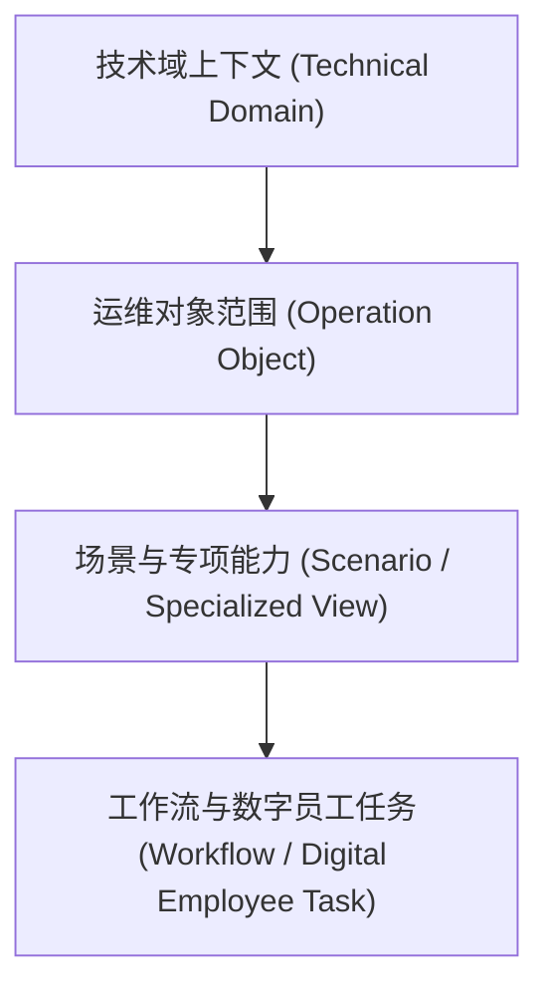

# 运维工作台四层层层级架构模型

## 1. 架构演进背景

在旧版本设计中，工作台的层级仅表达为单一的 `技术域 -> 集群/应用`（二层平铺）。随着 Flink/Spark/HDFS 等高细粒度专项能力的增加，以及跨技术域场景扩展（如 GBase 实例/会话、开发治理元数据表血缘、数据 App SLA 调度链等）的接入，这种简化的二层架构导致了：
* Flink 作业和 Spark 离线任务在集群选择器下表现极其怪异；
* HDFS 离线分析和小文件扫描不能只用“集群”表达对象范围；现实边界应是 `集群 -> Namespace -> 目录热点`；
* 场景在左侧菜单被硬编码写死，无法做到热插拔或元数据驱动。

为此，我们将工作台层级重构为以下 **四层层级结构模型**。

---

## 2. 四层架构模型定义

### 第一层：技术域上下文 (Technical Domain Context)
* **定位**：最高边界。决定了数据范围、对象类型和可用场景的集合。
* **主要取值**：
  * `all` (跨域/全部技术域)
  * `hadoop` (BCH 开源大数据生态)
  * `fi` (FusionInsight 商业大数据生态)
  * `gbase` (GBase 分布式数据库)
  * `governance` (数据开发与治理平台)
  * `dataapps` (数据应用与 SLA 运维)

### 第二层：运维对象范围 (Operation Object Scope)
* **定位**：运行上下文的实例主体，取代了单纯的“集群”。任何诊断与调优场景，都必须绑定到特定的运维对象及其子节点上。
* **对象类型映射**：
  * **集群/应用级**：`cluster:xxx`（如 hadoop 物理集群、FI 逻辑集群等）
  * **作业级**：`flink_job:xxx`, `spark_job:xxx`, `schedule_task:xxx` (调度任务)
  * **数据库级**：`database_instance:xxx`, `tablespace:xxx`, `session:xxx`
  * **元数据/目录级**：`namespace:cluster:ns` (HDFS 集群内命名空间), `directory:cluster:ns:/path` (HDFS 静态治理热点目录), `metadata_table:xxx`
  * **全局/全域默认**：`all`（未选择具体实例时，回退到当前技术域的全部范围）

### 第三层：场景与专项能力 (Scenario / Specialized View)
* **定位**：工作中心下的核心业务场景卡。工作台主导航（工作中心：事件、巡检、诊断、治理、容量性能、变更护航）保持稳定，内部的专项能力以**场景注册表**形式动态渲染。
* **实例**：
  * BCH 作业调优 -> 治理中心场景下加载 `bch-spark-tuning`
  * HDFS 容量调优 -> 容量中心场景下加载 `bch-hdfs-capacity`
  * GBase 慢 SQL 诊断 -> 诊断中心场景下加载 `gbase-slow-sql`

### 第四层：工作流与数字员工任务 (Workflow / Digital Employee Task)
* **定位**：最终闭环实体。所有 AI 生成结论或人工干预的结论必须落为有迹可循的任务。
* **实体**：
  * `EmployeeTask` (执行记录)：记录 `taskId/scenarioId/domain/objectRef/input/output/evaluation/operator`
  * 事件确认/驳回记录，自动沉淀为采纳率与工时节省指标。

---

## 3. 对开发者的约束与规范

1. **场景注册规范**：
   新增场景时，请查阅并填写 [workbench-scenario-onboarding-template.md](file:///Users/isadmin/MagicSpace/openocta/docs/workbench-scenario-onboarding-template.md)。必须在注册元数据中明确指定其支持的 `objectTypes`。
2. **深度上下文传递**：
   从场景详情发起 AI 问诊或记录闭环时，生成的结果及执行记录必须包含完整的 `objectRef`（如 `flink_job:MyJob1`）以及当前 `timeRange`。
3. **数据兜底**：
   如果没有获取到具体的子对象（第二层），各场景详情必须能回退至 `all` (全域/全部集群)。
4. **目录语义**：
   HDFS `/tmp`、`/user`、`/app` 等目录 scope 是建设初期的静态治理热点目录，必须附带集群和 namespace 上下文，用于小文件、Trash、容量风险聚焦；不得在 UI 或文档中表述为实时 HDFS 目录树枚举。
