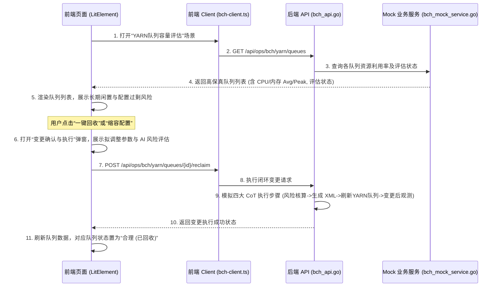

# YARN 队列容量评估与回收闭环场景设计

本方案旨在在运维工作台的“容量性能”模块中，新增一个 **Yarn 资源队列容量评估 (bch-yarn-capacity)** 闭环场景。通过分析集群中各 YARN 队列的配置配额与实际 CPU/内存 水位，智能识别“长期闲置 (Idle)”与“配置过剩 (OverAllocated)”的队列，并支持一键下发配置回收/缩容闭环操作，展示完整的 AI 决策和动态执行链条。

---

## 整体架构与流程设计



---

## 详细设计方案

### 1. 后端数据结构与 API 设计

在 Go 后端定义 YARN 资源队列的相关结构体，并实现获取队列列表和执行一键回收的 HTTP 接口。

#### A. 后端数据结构 (`src/pkg/ops/bch_service.go`)
```go
// YarnQueueMetric 队列历史利用率指标
type YarnQueueMetric struct {
	AvgCpuPercent  float64 `json:"avgCpuPercent"`  // 均值 CPU 利用率
	MaxCpuPercent  float64 `json:"maxCpuPercent"`  // 峰值 CPU 利用率
	AvgMemPercent  float64 `json:"avgMemPercent"`  // 均值 内存利用率
	MaxMemPercent  float64 `json:"maxMemPercent"`  // 峰值 内存利用率
	ActiveApps     int     `json:"activeApps"`     // 活跃作业数
}

// YarnQueueEvaluation YARN 资源队列容量评估记录
type YarnQueueEvaluation struct {
	ID                 string          `json:"id"`                 // 队列路径，如 root.prod.spark
	Name               string          `json:"name"`               // 队列中文名称
	Cluster            string          `json:"cluster"`            // 所属集群
	ConfiguredCapacity string          `json:"configuredCapacity"` // 配置配额描述，如 "30% (120 Core / 480 GB)"
	Metrics            YarnQueueMetric `json:"metrics"`
	Status             string          `json:"status"`             // idle (长期闲置), over_allocated (配置过剩), healthy (合理), under_allocated (负载过高)
	Advice             string          `json:"advice"`             // 智能评估建议
	Action             string          `json:"action"`             // 建议动作：reclaim (回收), downsize (缩容), expand (扩容), none (无需操作)
	TargetCapacity     string          `json:"targetCapacity"`     // 调整后期望配额，如 "3% (12 Core / 48 GB)"
}
```

#### B. Mock 业务数据 (`src/pkg/ops/bch_mock_service.go`)
注入 5-6 个覆盖不同水位模式的典型队列：
- `root.default` (10% 配额, 状态: healthy)
- `root.dev.flink` (25% 配额, 状态: healthy)
- `root.prod.spark` (35% 配额, 状态: under_allocated, 负载过高)
- `root.offline.batch` (20% 配额, 状态: over_allocated, 配置过剩, 建议缩容至 5%)
- `root.test` (8% 配额, 0.2% 历史使用率, 状态: idle, 长期闲置, 建议回收至 1% 或直接删除)
- `root.temp_sandbox` (2% 配额, 0% 历史使用率, 状态: idle, 长期闲置, 建议完全回收)

#### C. API 路由设计 (`src/pkg/gateway/http/server.go` 与 `bch_api.go`)
- **获取队列列表**: `GET /api/ops/bch/yarn/queues` -> `handleBchListYarnQueues`
- **执行闭环回收/缩容**: `POST /api/ops/bch/yarn/queues/{id}/reclaim` -> `handleBchReclaimYarnQueue`
  - 接收包含目标配额的请求。
  - 后端直接修改 Mock 数据的状态为 `healthy` (已回收/已缩容)，并在操作历史中记录动作，以供前端刷新体现闭环的真实数据流。

---

### 2. 前端场景注册与数据获取

#### A. 场景元数据注册 (`ui/src/ui/ops/scenario-registry.ts`)
```typescript
  {
    id: "bch-yarn-capacity",
    title: "YARN 队列容量评估",
    domain: "hadoop",
    center: "capacity",
    icon: "usageBars",
    summary: "评估 YARN 队列历史资源利用率，智能识别长期闲置或配置过剩的队列并支持一键回收/缩容闭环。",
    objectTypes: ["yarn_queue", "cluster"],
    triggers: ["manual", "schedule"],
    inputs: ["YARN Metrics", "Capacity Scheduler 配置", "队列历史资源使用率"],
    outputs: ["合理度评估", "回收/缩容建议", "变更执行报告"],
    maturity: "automated",
    automationLevel: "closed-loop",
    owner: "BCH 运维团队",
    primaryMetric: "CPU / 内存使用率 / 闲置率",
    secondaryMetric: "近 30 天队列分析",
    recommendedActions: ["回收长期闲置队列", "缩容配置过剩队列", "刷新 YARN 动态调度配置"],
    runbooks: ["YARN 资源队列回收 SOP", "Capacity Scheduler 变更 SOP"],
  }
```

#### B. 前端 API 封装 (`ui/src/ui/controllers/bch-client.ts`)
```typescript
export interface YarnQueueMetric {
  avgCpuPercent: number;
  maxCpuPercent: number;
  avgMemPercent: number;
  maxMemPercent: number;
  activeApps: number;
}

export interface YarnQueueEvaluation {
  id: string;
  name: string;
  cluster: string;
  configuredCapacity: string;
  metrics: YarnQueueMetric;
  status: "idle" | "over_allocated" | "healthy" | "under_allocated";
  advice: string;
  action: "reclaim" | "downsize" | "expand" | "none";
  targetCapacity: string;
}

// 获取 YARN 队列列表
export async function fetchBchYarnQueues(host: any): Promise<YarnQueueEvaluation[]> { ... }
// 执行回收
export async function reclaimBchYarnQueue(host: any, id: string): Promise<{ success: boolean; message: string }> { ... }
```

---

### 3. 前端 UI 界面设计

在 `ui/src/ui/views/ops/bch-yarn-capacity.ts` 中实现自定义组件 `<bch-yarn-capacity>`。

#### A. 全局概览 (Dashboard Header)
- 仿照 Flink Job Health 的概览，增加一栏 "YARN 队列资源利用率画像"。
- 展示当前环境总队列数、闲置回收候选、配置过剩候选、预计回收资源大小。
- 数字员工助手一句话总结：“YARN Capacity Agent 正在监控资源调度。本周期共排查出 **2** 个长期闲置队列，累计可释放闲置配额达 **20% (80 Core / 320 GB)**。”

#### B. 核心列表表格 (仿 Flink 列表样式)
表格包含以下列：
1. **队列路径 (Queue Path)**: 粗体展示（如 `root.offline.batch`）
2. **所属集群 (Cluster)**: 胶囊标签（如 `prod-a`）
3. **已配置容量 (Configured Capacity)**: 单独展示配额占比和具体核数/内存
4. **最近使用率 (CPU / Mem)**:
   - 包含双层迷你进度条（均值利用率 + 峰值利用率）
   - CPU 与内存分别渲染，直观展示资源配置倒挂情况
5. **评估状态 (Status)**:
   - `长期闲置` (红色/橙色背景标签)
   - `配置过剩` (黄色背景标签)
   - `资源不足` (蓝色背景标签)
   - `合理` (绿色背景标签)
6. **优化评估建议 (AI Advice)**: 气泡形式或小文字，突出 AI 为什么判断该队列不合理。
7. **操作 (Actions)**:
   - 长期闲置 -> 渲染蓝色 `一键回收` 按钮
   - 配置过剩 -> 渲染蓝色 `缩容配置` 按钮
   - 负载过高 -> 渲染绿色 `扩容建议` 按钮 (弹出优化方案)
   - 合理 -> 渲染灰色置灰按钮 `无需操作`

#### C. 闭环执行弹窗 (Closed-Loop Executor Modal)
点击“一键回收”或“缩容配置”后，弹出精美的玻璃摩尔风格弹窗：
- **对比面板**: 直观展示“当前配置”与“拟调整后配置”的参数对比。
- **风险核算**: AI 签署的变更检查意见（如：“该队列近30天无活跃作业，保留 2% 基础容量供冒烟测试，安全级别：高”）。
- **执行状态流 (Timeline)**:
  - `[进行中/已完成]` 1. AI 风险核算 & 配置合法性校验 (检查是否有正在排队的 Container)
  - `[等待中/已完成]` 2. 生成配置变更描述 XML 并写入 `capacity-scheduler.xml`
  - `[等待中/已完成]` 3. 执行 YARN 动态刷新命令 (`yarn rmadmin -refreshQueues`)
  - `[等待中/已完成]` 4. 变更后资源水位持续性校验 (进行 5 分钟滑动窗口观测)
- 用户点击“确认执行变更”，进度条开始滚动，最终完成闭环。

---

## 验证与发布方案

### 自动化测试
1. 在后端 `src/pkg/gateway/http/ops_api_test.go` 中添加对应的路由拦截与 JSON 数据解析断言测试。
2. 运行本地验证脚本，确保路由通顺。

### 手动验证
1. 启动本地项目 `npm run dev` 并在浏览器中点击侧边栏导航至工作台 -> 容量性能 -> 选择 YARN 队列容量评估场景。
2. 验证队列数据载入是否成功、表格展示是否与 Flink 保持高品质视觉一致。
3. 执行一键回收，验证弹窗 Timeline 执行动效和表格数据的自动刷新刷新逻辑。

---

> [!NOTE]
> 这是一个典型的 AI 闭环 (Closed-loop) 场景。变更动作将直接调用 YARN 刷新命令，体现了“分析-诊断-决策-执行-反馈”的闭环能力。
